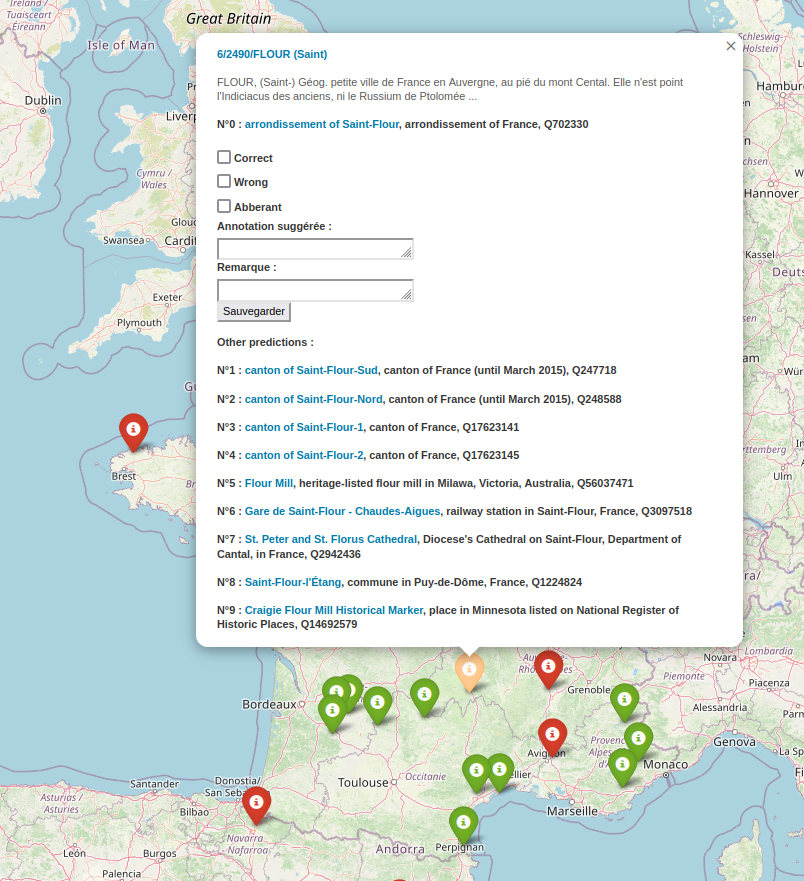

# MapAnnot
 annotating geocoding results

A tool to annotate results of an Entity Linking process based on Flask and folium

The following instructions will consecutively :
- import the dependancies
- generate the map HTML file
- run the app.py script to start the Flask server

```python
pip install folium flask ;
python map_with_annotation.py ;
python app.py
```

## Inputs
The input is a dict of predictions from the Entity Linking pipeline. At the key `pred_id`, we find a list of the top 10 predictions :
```json
{
  "test_france": [
    {
      "rank": 0,
      "pred_id": "Q3390498",
      "pred_coords": [48.8458, 2.37243],
      "acc@10": false,
      "label": ["place des Combattants-en-Afrique-du-Nord"],
      "desc": "place de Paris, France"
    },
    ...
  ]
}
```

## OUtputs
The annotations, along with the hash value and the state of each checkbox (correct, wrong, abberant), are sent to the Flask server upon form submission. The server saves the collected data in a json file (annotations.json) in the following format:
```json
{
   "8/252/HAMIZ-MUTAGARA": {  # hidden hash value of the sample
      "annotation": "test",   # annotation text provided by the user
      "correct": null,        # 1st tickbox option
      "wrong": "False",       # 2nd 
      "abberant": "aberant",  # 3rd
      "note": "mispelled ?"   # note provided by the user
   }
}
```
**TODO**
- [X] inserting `def retrieve_info(QID)` collecting label and description from WD
- [X] display top 10 suggestions at the end
- [ ] `def retrieve_info(QID)` from SOLR 
- [ ] add metadatas to annotation file : as input of app.py ? 


