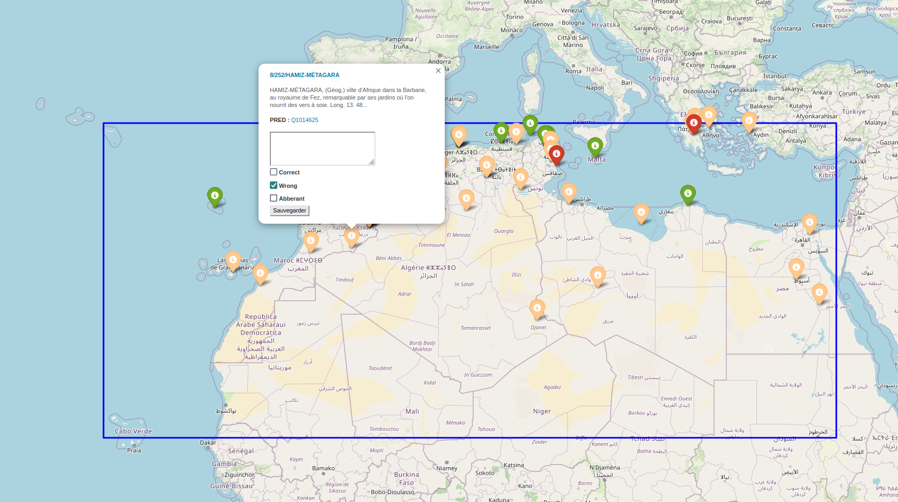

# MapAnnot
 annotating geocoding results

A tool to annotate results of an Entity Linking process based on Flask and folium

The following instructions will consecutively :
- import the dependancies
- generate the map HTML file
- run the app.py script to start the Flask server

```python
pip install folium flask ;
python map_with_annotation.py ;
python app.py
```

**Inputs**
- `Annotation Text`: A text area in the popup where users can enter their annotations.
- `Tickboxes`: Three checkboxes in the popup allowing users to mark the annotation as: Correct, Wrong, Aberant
- `Hash Value`: A predefined hidden input field with a specific hash value associated with each annotation.

**Output** :The annotations, along with the hash value and the state of each checkbox (correct, wrong, abberant), are sent to the Flask server upon form submission. The server saves the collected data in a json file (annotations.json) in the following format:
```json
{
   "8/252/HAMIZ-MUTAGARA": {
      "annotation": "test",
      "correct": null,
      "wrong": "False",
      "abberant": "aberant"
   }
}
```


